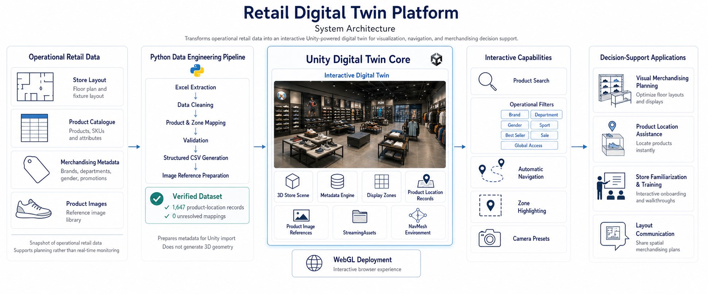
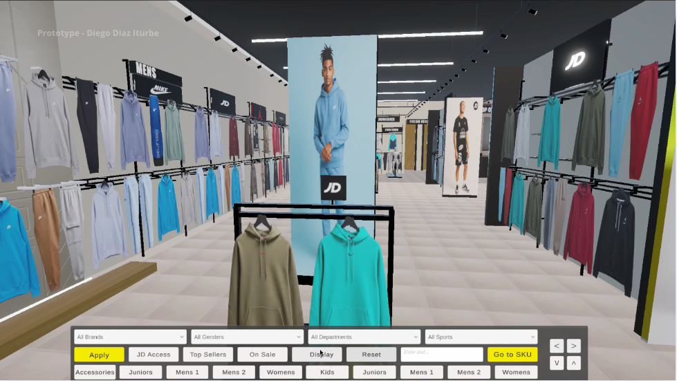
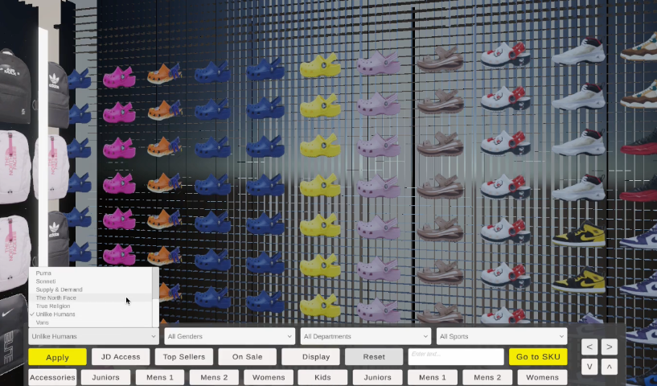
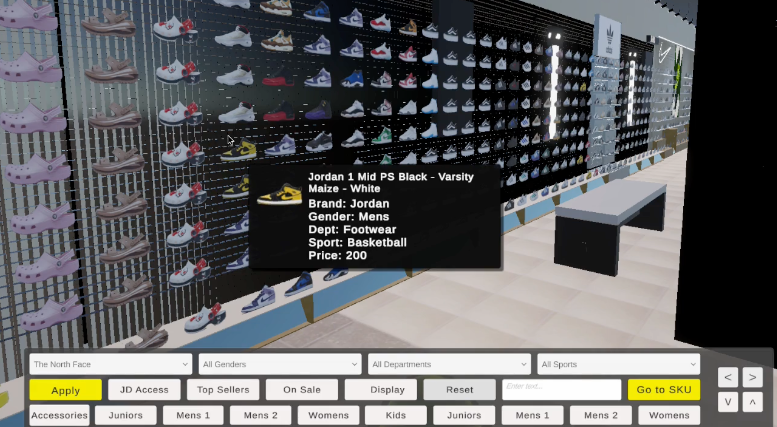
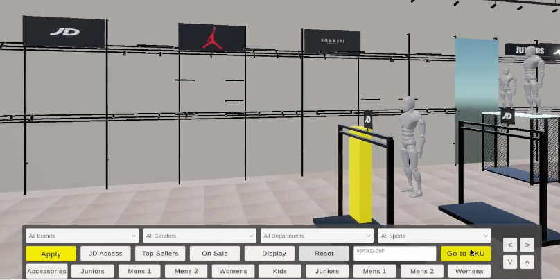
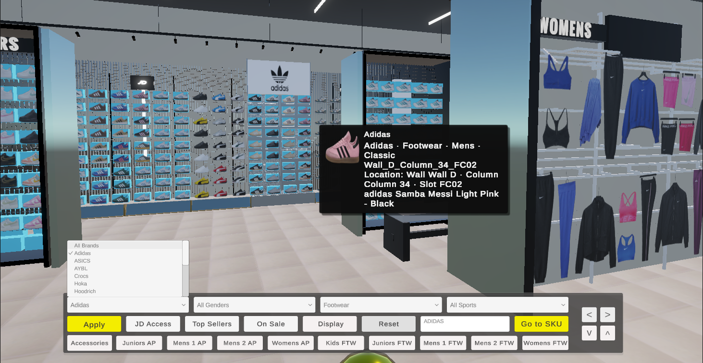
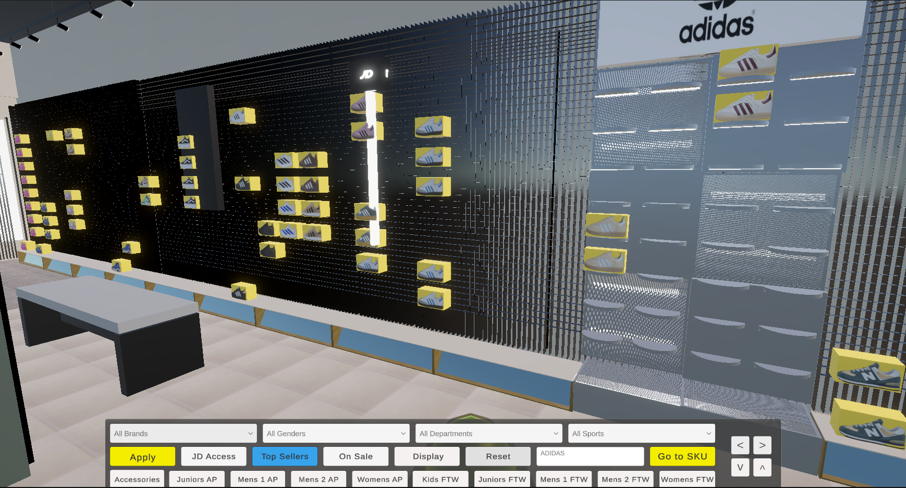
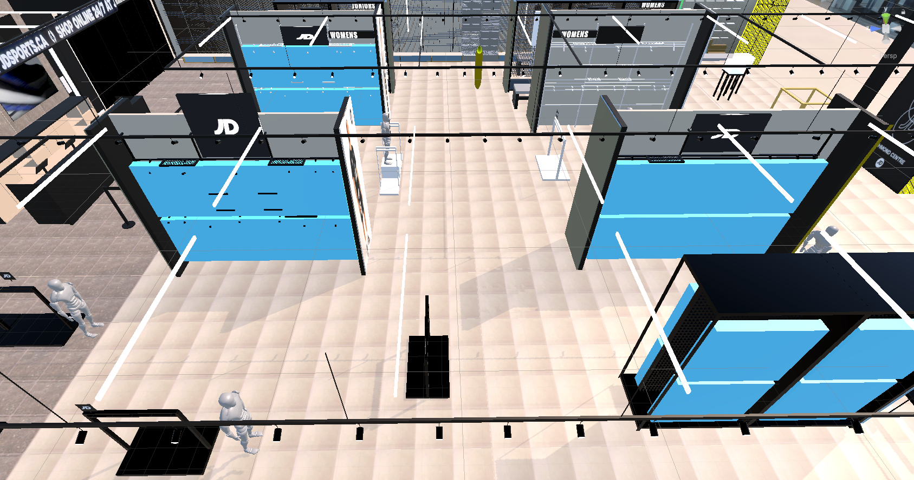
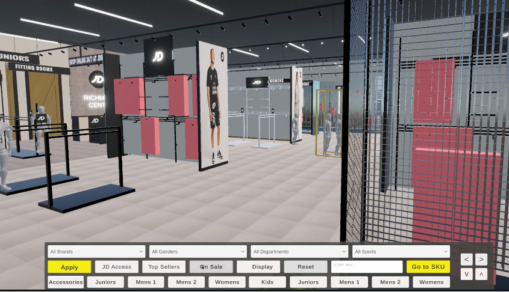
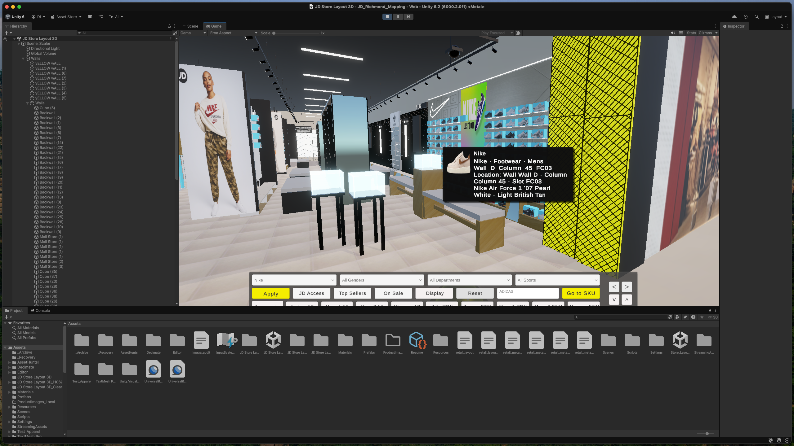

# Retail Digital Twin Platform

### Interactive 3D Visualization & Decision Support for Retail Operations

> Transforming operational retail data into an interactive digital twin that supports merchandising, navigation, planning, and operational decision-making.


The **Retail Digital Twin Platform** transforms operational retail information into an interactive three-dimensional representation of a real retail store.

Instead of relying on spreadsheets, merchandising directives, printed layouts, and product catalogues, the platform combines operational metadata with an immersive Unity environment that enables interactive exploration, product search, navigation, visualization, and operational decision support.

---

# 🌐 Live Experience

### Live WebGL Application


### Project Walkthrough

[](https://www.youtube.com/watch?v=wC4Yr8rvEIE)

### Portfolio Case Study

> *(Add portfolio case study URL when published)*

---

# 📌 Project Snapshot

- 🏬 Interactive digital replica of a real retail store
- 📦 1,647 operational product-location records
- ✅ Zero unresolved product mappings
- 🔎 Instant SKU and metadata search
- 🧭 Automatic navigation to products
- 🎯 Interactive merchandising zone highlighting
- 🐍 Python-powered metadata generation pipeline
- 🎮 Unity WebGL deployment

---

# Executive Summary

Large retail stores manage thousands of products distributed across dozens of departments, fixtures, and merchandising zones.

Although operational information already exists inside spreadsheets, product catalogues, and merchandising directives, these resources rarely communicate one essential component:

> **Space.**

The Retail Digital Twin Platform transforms operational retail data into an interactive environment where merchandising information becomes spatially understandable.

Instead of interpreting multiple disconnected documents, managers can explore the store virtually, locate products instantly, understand layouts, and visualize merchandising decisions in context.

---

# The Challenge

Retail operations depend on numerous disconnected information sources:

- Product catalogues
- Merchandising directives
- Floor plans
- Product images
- Store layouts
- Operational spreadsheets
- Staff experience

While these documents accurately describe products, they do not communicate the physical retail environment effectively.

Understanding where products are located, how departments connect, or how merchandising changes impact the store often requires significant manual interpretation.

---

# The Solution

The Retail Digital Twin Platform combines automated Python data engineering with an interactive Unity visualization layer.

Operational metadata is validated, transformed, and synchronized before being imported into Unity, where it becomes an intelligent three-dimensional representation of the store.

The result is a practical operational decision-support platform capable of improving planning, visualization, navigation, communication, and training.

---

# 🏗 System Architecture

The platform follows a five-layer architecture that transforms operational retail information into an interactive decision-support application.



### Layer 1 — Operational Retail Data

- Store layouts
- Product catalogue
- Merchandising metadata
- Product image library

### Layer 2 — Python Data Engineering Pipeline

- Excel extraction
- Data cleaning
- Product validation
- Metadata generation
- CSV synchronization

### Layer 3 — Unity Digital Twin Core

- Interactive 3D environment
- Metadata importer
- Display zones
- Product-location database
- NavMesh navigation
- WebGL deployment

### Layer 4 — Interactive Capabilities

- Product search
- Operational filters
- Automatic navigation
- Zone highlighting
- Camera presets

### Layer 5 — Decision Support

- Visual merchandising planning
- Product location assistance
- Store familiarization
- Layout communication

---

# 🎥 Live Demonstration

Explore the interactive digital twin in action.

[](https://www.youtube.com/watch?v=wC4Yr8rvEIE)

---

# Platform Walkthrough

## Interactive Store Overview

Explore the complete retail environment while preserving the real spatial relationships between departments, fixtures, and merchandising zones.



---

## Product Search & Operational Filters

Locate products instantly using operational filters including Brand, Department, Gender, Sport, Promotions, and Best Sellers.



---

## Product Metadata

Every displayed product is connected to operational metadata, allowing users to retrieve product information directly from the digital twin.

- SKU
- Brand
- Department
- Gender
- Sport
- Product image
- Display location



---

## Smart Navigation

Navigate directly to any product location using Unity's NavMesh navigation system.



---

## Brand & Department Visualization

Quickly isolate merchandising displays using operational filters.



---

## Zone Highlighting

Visualize merchandising zones and display walls interactively.



---

# 🛠 Building the Digital Twin

The interactive environment is generated through an automated pipeline that combines operational data with spatial configuration.

## Display Zone Configuration

Merchandising walls, display fixtures, and operational zones are spatially configured inside Unity before metadata is attached.



---

## Merchandising Layout Representation

The virtual environment mirrors the physical retail layout, allowing future merchandising changes to be planned and communicated visually.



---

## Unity Development Environment

The project was developed entirely inside Unity using custom scripts, prefabs, metadata importers, and StreamingAssets synchronization.



---

# Technology Stack

| Layer | Technologies |
|--------|--------------|
| Visualization | Unity 6 |
| Programming | C# |
| Data Engineering | Python |
| Metadata | CSV |
| Navigation | Unity NavMesh |
| UI | Unity UI Toolkit |
| Deployment | Unity WebGL |
| Version Control | Git & GitHub |

---

# Repository Structure

```text
📁 Assets
├── 📁 Scenes
├── 📁 Scripts
├── 📁 Prefabs
├── 📁 Materials
├── 📁 Resources
├── 📁 StreamingAssets
└── 📁 UI

📁 Python
├── 📄 Metadata Generator
├── 📄 CSV Builder
└── 📄 Data Processing

📁 Build

📁 Documentation
```

---

# Real-World Applications

Although initially developed as a retail proof-of-concept, the underlying architecture can support numerous operational scenarios.

- Visual Merchandising Planning
- Product Location Assistance
- Interactive Store Familiarization
- Layout Validation
- Merchandising Communication
- Operational Planning
- Interactive Training
- Multi-store Digital Twins
- Future GIS Integration
- Operational Analytics

---

# Roadmap

### Next Improvements

- Improved navigation experience
- Additional metadata panels
- Better UI/UX
- Performance optimization
- Enhanced search capabilities

### Long-Term Vision

- Azure Digital Twins integration
- ArcGIS integration
- Multi-store environments
- Live inventory synchronization
- AI-assisted merchandising recommendations
- Space optimization analytics
- Operational dashboards
- Customer movement visualization

---

# About the Author

**Diego Ernesto Díaz Iturbe**

Data Analytics • Retail Operations • Automation • Interactive Visualization

This project demonstrates how operational data, software engineering, and interactive visualization can be combined to create practical decision-support tools for real-world retail environments.

---

## Portfolio

https://impactomex.wixsite.com/eportfolio

## LinkedIn

https://linkedin.com/in/diegodiaziturbe
